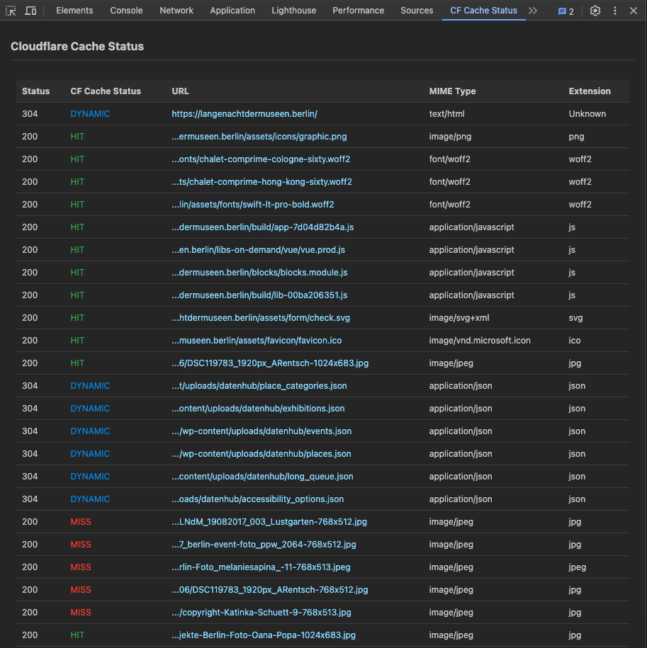

# Cloudflare Cache Status Extension

Welcome to the repository of the **Cloudflare Cache Status Extension** for Chrome DevTools, developed by Michael Fritz at Henne Ordnung GmbH. This extension enhances Chrome Developer Tools by adding a custom panel that displays detailed information about network requests, focusing particularly on the Cloudflare cache status.


*Screenshot of the Cloudflare Cache Status Extension in action*

## Features

- **Cache Status Display**: Displays the Cloudflare cache status (HIT, MISS, DYNAMIC, etc.) for each network request directly in Chrome DevTools.
- **Enhanced URL Insights**: Shows clickable URLs, displaying only the last 40 characters for brevity, which can be clicked to open the resource.
- **Detailed Response Information**: Provides the HTTP status code, MIME type, and file extension of each resource, enhancing your debugging capabilities.
- **Dynamic Updates**: Automatically updates the list of network requests upon page navigation or reload, ensuring the data is always current and relevant.

## Installation

To install the Cloudflare Cache Status Extension, follow these simple steps:

1. **Clone the Repository**:
   ```bash
   git clone https://github.com/mitchiru/chrome-cloudflare-status.git

2. **Load the Extension in Chrome:**:
- Open Chrome and navigate to chrome://extensions/
- Enable Developer Mode by toggling the switch at the top right corner.
- Click "Load unpacked" and select the directory where you cloned the repository.

3. **Accessing the Extension**:
- Open Chrome Developer Tools (either right-click on any page and select "Inspect" or press Ctrl+Shift+I).
- Locate the "Cloudflare Cache Status" tab in the Developer Tools panel to start using the extension.

## Contributing
We welcome contributions to the Cloudflare Cache Status Extension! If you have suggestions for improvements or bug fixes, please fork the repository and submit a pull request.

## License
This project is licensed under the MIT License - see the LICENSE file for details.

http://www.henne-ordnung.de